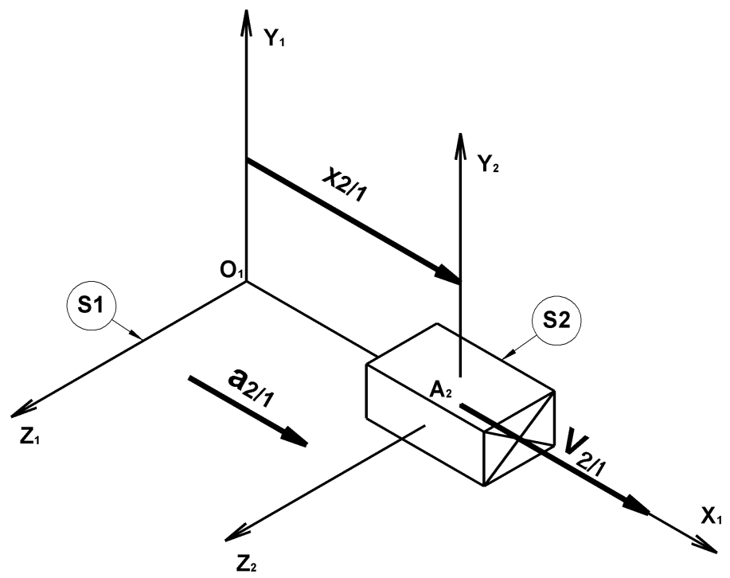
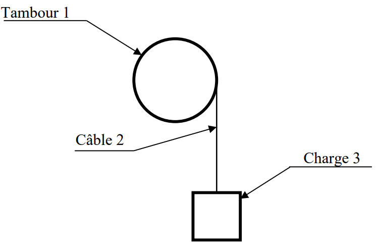
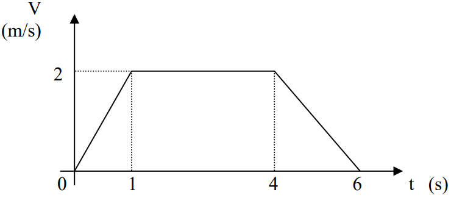
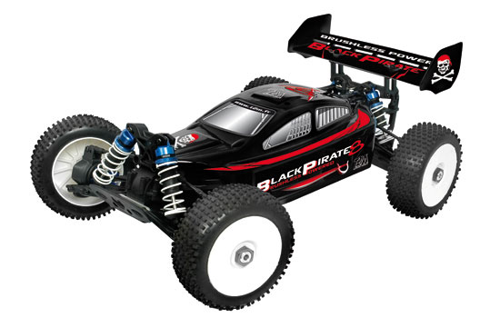
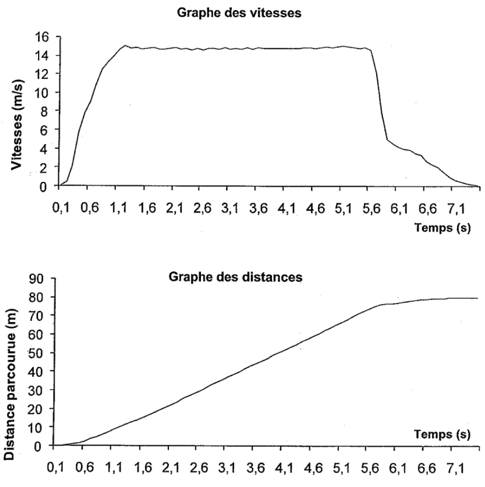
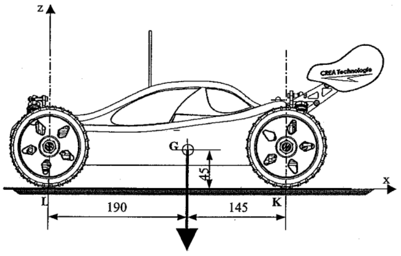

## Etude du comportement dynamique d'un solide en translation rectiligne

### Aspects cinématiques

#### Paramétrage du modèle glissière

{.center width=60%}

#### Equations horaires du mouvement uniforme

...

...

...

#### Equations horaires du mouvement uniformément varié

...

...

...

...

??? example "Application de cours : **Etude du comportement dynamique d’un treuil**"

    {.center width=50%}

    La figure ci-dessus représente un treuil. Un moto réducteur, non représenté, entraîne en rotation le tambour 1, sur lequel s’enroule le câble 2 et permet ainsi de lever la charge 3.    

    La charge de masse $m = 10 kg$ est soulevée en trois phases décrites par le graphe des vitesses ci-dessous :

    {.center width=60%}

    - Caractériser le mouvement de la charge pour chacune des trois phases.

??? example "Application : **[T2M Buggy Black Pirate](http://www.t2m-rc.fr/de/modellbau-t2m-black-pirate-8-rtr-ohne-akku-T4903.html){target=_blank}**"

    {align=left width=30%}{align=right width=30%}
    
    !!! quote ""        
        Le Black Pirate est un Buggy tout terrain 1/8, 4x4, 3 différentiels, à propulsion électrique Brushless :
        
        - Vitesse maxi : $70 km/h$ environ
        - Accélérations phénoménales : $1,5 \times g$ !!
        - La masse totale du buggy est $m = 3,60 kg$
    
    

    #### Q1) Analyse des performaces annoncées par le constructeur
    
    - Calculer le temps que mettrait le buggy pour atteindre sa vitesse maximale
    
    #### Q2) Comparaison avec les performances relevées sur piste

    Lors d’un essai sur piste de terre, une mesure de vitesse a été effectuée ; Sur une ligne droite, voiture à l’arrêt, nous effectuons une accélération pour atteindre la vitesse maximale, suivi d’un maintien de la vitesse, puis suivi d’un freinage jusqu’à l’arrêt complet.
    {.center width=70%}
    
    - Repérer sur les graphes les différentes phases (étapes) de l’essai effectué ;
    - Relever la valeur de la vitesse maximale atteinte et en déduire l’accélération au démarrage :
    - Comparer avec les performances annoncées.

### Principe fondamental de la dynamique

???+ abstract "Théorème de la résultante dynamique"

    La  somme  vectorielle  des  actions  mécaniques  extérieures  appliquées  à  un  solide  $S$  en  mouvement  de  translation  par rapport à un repère absolu $R = (O, \overrightarrow{x}, \overrightarrow{y}, \overrightarrow{z})$ est égale au produit de la masse de ce solide par l’accélération de son centre de gravité $G$.

    ...

    ...

    ...

    ... Unités :

???+ abstract "Théorème du moment dynamique résultant"

    La somme vectorielle des moments des actions mécaniques extérieures appliquées à un solide $S$ en mouvement de translation par rapport à un repère absolu $R = (O, \overrightarrow{x}, \overrightarrow{y}, \overrightarrow{z})$ est nulle à son centre de gravité G.

    ...

    ...

    ...

    ...
    
    Unités :

    !!! note "Remarque"
        - le théorème du moment implique que la résultante des actions mécaniques extérieures passe par $G$, sinon son moment par rapport à $G$ n’est pas nul.
        - Les cas de l’équilibre statique ou lorsque le mouvement est uniforme sont des cas particuliers de la dynamique (cas où l’accélération est nulle).

??? example "Application de cours : **Etude du comportement dynamique d’un treuil**"

    {.center width=50%}

    La figure ci-dessus représente un treuil. Un moto réducteur, non représenté, entraîne en rotation le tambour 1, sur lequel s’enroule le câble 2 et permet ainsi de lever la charge 3.    

    La charge de masse $m = 10 kg$ est soulevée en trois phases décrites par le graphe des vitesses ci-dessous :

    {.center width=60%}

    - Isoler la charge et déterminer la tension du câble pour chaque phase en considérant l'accélération de la pesanteur $g=10 m/s^2$. 

??? example "Application : **[T2M Buggy Black Pirate](http://www.t2m-rc.fr/de/modellbau-t2m-black-pirate-8-rtr-ohne-akku-T4903.html){target=_blank}**"

    {align=left width=30%}{align=right width=30%}
    
    !!! quote ""        
        Le Black Pirate est un Buggy tout terrain 1/8, 4x4, 3 différentiels, à propulsion électrique Brushless :
        
        - Vitesse maxi : $70 km/h$ environ
        - Accélérations phénoménales : $1,5 \times g$ !!
        - La masse totale du buggy est $m = 3,60 kg$
    
    {.center width=50%}

    #### Q3) Etude du phénomène de « transfert de charge » et détermination du coefficient d’adhérence
    
     

    - Déterminer la répartition de la charge sur les roues arrière et avant lorsque le véhicule accélère ;
    - Qu’en est-il lorsque le véhicule est à vitesse constante ?
    - Déterminer le coefficient d’adhérence nécessaire pour transmettre une telle accélération ;
    - A partir de quelle accélération risque-t-on de cabrer ?
    - Discuter si les phénomènes de transfert de charge et de cabrage sont bénéfiques à la propulsion et/ou à la traction d’un véhicule automobile…