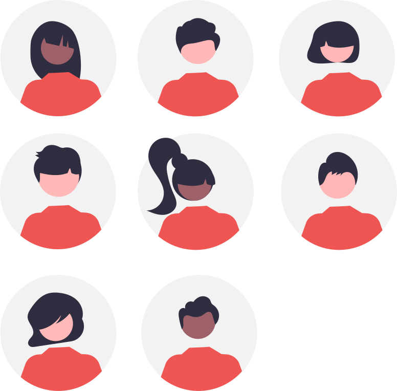

## Avertissement :

[{: align=left width=10%}](){target=_blank}[{: align=right width=10%}](mailto:){target=_blank}Ce site s'adresse au groupe des élèves de terminales du lycée Notre Dame du Mur qui suivent l'enseignement de spécialité des Sciences de l'Ingénieur.

<!-- ### Autres liens du groupe :

- [Sharepoint](https://ecmorlaix.sharepoint.com/sites/TEAM-1SI-20212022/Documents%20partages/Forms/AllItems.aspx?CT=1633078246893&RootFolder=%2Fsites%2FTEAM%2D1SI%2D20212022%2FDocuments%20partages%2FGeneral&FolderCTID=0x012000019689D1FEC0FB4E86F4D05CA2B5A0EC){target=_blank}
- [Conversation](https://outlook.office365.com/mail/group/ecmorlaix.fr/team-1si-20212022/email){target=_blank} -->

***

{: .center width=50%}

[mail]: mailto:eric.madec@ecmorlaix.fr "eric.madec@ecmorlaix.fr"

<!-- ***
## Du 29/03

=== "CONTENU DE SÉANCE" 

    - Introduction de RDM, la [Résistance Des Matériaux](./RDM/Cours_RDM.pdf){target="_blank"} ;

    <figure>
        <iframe width="560" height="315" src="https://www.youtube-nocookie.com/embed/MEFKvVCI3mo" title="YouTube video player" frameborder="0" allow="accelerometer; autoplay; clipboard-write; encrypted-media; gyroscope; picture-in-picture" allowfullscreen></iframe>
    </figure>

    - **Faire** les [exercices de RDM](./RDM/Exercices_RDM.pdf){target="_blank"} ;

    <figure>
        <iframe width="560" height="315" src="https://www.youtube-nocookie.com/embed/gk_Pby-m5Wc" title="YouTube video player" frameborder="0" allow="accelerometer; autoplay; clipboard-write; encrypted-media; gyroscope; picture-in-picture" allowfullscreen></iframe>
    </figure>

    - **Faire** le [TP de RDM sous SolidWorks-Simulation](./RDM/TP_rdm_equerre.zip) et produire un compte rendu collectif dans un format numérique ;

=== "TRAVAIL À FAIRE"

    - Pour bien comprendre, **lire** [les diaporamas de NewEcLigne au sujet de la RDM](https://sites.google.com/view/newecligne/m%C3%A9canique/r%C3%A9sistance-des-mat%C3%A9riaux){target="_blank"} ;
    - Pour aller plus loin, **découvrir** une méthode pour [choisir un matériaux](./RDM/Choix_materiaux.pdf){target="_blank"} selon une combinaison de critères...
    - [Grand Oral](https://eduscol.education.fr/729/presentation-du-grand-oral){target=_blank} ;

***
## Du 15/03

=== "Révisions à partir des sujets 2023"

    - [Centres étranger J1](./SE/spe_sciences_ingenieur_2023_centres_etranger_1_sujet_officiel.pdf){target=_blank}
    - [Centres étranger J2](./SE/spe_sciences_ingenieur_2023_centres_etranger_2_sujet_officiel.pdf){target=_blank}
    - [Polynésie J1](./SE/spe_sciences_ingenieur_2023_polynesie_1_sujet_officiel.pdf){target=_blank}

=== "Propositions de correction partagées"

    - [Centres étranger J1](){target=_blank}
    - [Centres étranger J2](){target=_blank}
    - [Polynésie J1](){target=_blank}

***
## Les 01 et 02/03

=== "CONTENU DE SÉANCE" 
    
    - Correction des sujets de bac [Efoil](./SE/Efoil-2022.pdf){target=_blank} et [Robot Barman](./SE/Robot_Barman-2022.pdf){target=_blank} ;    
    - Codeurs de position : **lire** le [cours](./CI/Codeur-Cours.pdf){target=_blank} et **faire** les [exercices](./CI/Codeur-exercices.pdf){target=_blank} (cf : [document ressource détection mécanique et électronique](./CI/Detection_mecanique_electronique.pdf){target=_blank} ;
    - Participation aux [activités d'escape game pour l'accueil des troisièmes](https://ericecmorlaix.github.io/accueil_3/){target=_blank} le 02/03 ;

=== "TRAVAIL À FAIRE"

    - **Faire** le sujet de bac [NINO](./SE/NINO-2022.pdf){target=_blank} ;
    - **Faire** la [mise à jour d'Obsidian pour découvrir les canvas](https://ericecmorlaix.github.io/adn-Tutoriel_Obsidian/7-Options_Plugins/#canvas){target=_blank} ;

***
## Du 01 au 10/02

=== "CONTENU DE SÉANCE" 
    
    - Synthèse partielle du parcours n°3 de la programmation des objets connectés avec la carte [**QuickPi**](https://amazon.quick-pi.org/){target="_blank"} ;
    - [Modelisation_Chaine_De_Puissance-Le_Moteur_du_Slider](https://nbviewer.org/urls/ericecmorlaix.github.io/TSI_2022-2023/CP/Modelisation_Chaine_De_Puissance-Le_Moteur_du_Slider.ipynb){target="_blank"} ;[:fontawesome-solid-download:](https://ericecmorlaix.github.io/TSI_2022-2023/CP/Modelisation_Chaine_De_Puissance-Le_Moteur_du_Slider.ipynb){ .md-button .md-button--primary} ;
    - Moteurs à Courant Continu : **lire** le [cours](./CP/MCC-Cours.pdf){target=_blank} et **faire** les [exercices](./CP/MCC-exercices.pdf){target=_blank} ;
    - Codeurs de position : **lire** le [cours](./CI/Codeur-Cours.pdf){target=_blank} et **faire** les [exercices](./CI/Codeur-exercices.pdf){target=_blank} (cf : [document ressource détection mécanique et électronique](./CI/Detection_mecanique_electronique.pdf){target=_blank} ;

=== "TRAVAIL À FAIRE"

    - **Poursuivre** la programmation des objets connectés avec la carte [**QuickPi**](https://amazon.quick-pi.org/){target="_blank"} :
        - ==**notez, transmettez-moi et conservez** votre code personnel pour chaque parcours pour y retourner d'une fois sur l'autre== ;
        - **conserver** progressivement une trace de vos scripts...

    - ==**Faire** le sujet de bac [Robot Barman](./SE/Robot_Barman-2022.pdf){target=_blank} pour le 27/02== ;

***
## Le 25/01

=== "CONTENU DE SÉANCE" 
    - **Finir** [le TP de Régulation Thermique](./RA/TP_thermique/RegulationThermique-TP.pdf){target="_blank"} à l'aide des documents et fichiers `.psimsch`:
        - [Document ressources](./RA/TP_thermique/RegulationThermique-DR.pdf){target="_blank"} ;
        - [régulation de température T.O.R](./RA/TP_thermique/regulation_de_temperature_TOR.psimsch) ;
        - [régulation de température proportionnelle intégrale](./RA/TP_thermique/regulation_de_temperature_proportionnelle_integrale.psimsch) ;

=== "TRAVAIL À FAIRE"

    - **Reprendre** la programmation des objets connectés avec la carte [**QuickPi**](https://amazon.quick-pi.org/){target="_blank"} :
        - ==**notez, transmettez-moi et conservez** votre code personnel pour chaque parcours pour y retourner d'une fois sur l'autre== ;
        - **conserver** progressivement une trace de vos scripts...

***
## Les 11 et 12/01
=== "CONTENU DE SÉANCE" 
    - Régulation et asservivement :
        - **lire** [Introduction_notions](./RA/Introduction_notions.pdf){target="_blank"} ;
        - parallèlement, **lire** le [Cours](./RA/Cours.pdf){target="_blank"} et **comprendre** les [Exemples](./RA/Exemples.pdf){target="_blank"} ;
        - faire les [Exercices](./RA/Exercices.pdf){target="_blank"} ;

    - Application aux questions 7 et 8 du sujet [Xtrack](./SE/Camera_Mobile.pdf){target="_blank"} ;

=== "TRAVAIL À FAIRE"

    - **regarder** les vidéo :

      <iframe width="560" height="315" src="https://www.youtube-nocookie.com/embed/uqaMfvSmiI8" title="YouTube video player" frameborder="0" allow="accelerometer; autoplay; clipboard-write; encrypted-media; gyroscope; picture-in-picture" allowfullscreen></iframe>

      <iframe width="560" height="315" src="https://www.youtube-nocookie.com/embed/qQxnm6jAkNE" title="YouTube video player" frameborder="0" allow="accelerometer; autoplay; clipboard-write; encrypted-media; gyroscope; picture-in-picture" allowfullscreen></iframe>

    - **Faire** les questions non traitées du sujet [MELODY](./SE/MELODY.pdf){target="_blank"} en particulier Q1.7 à Q1.9 et Q1.22 puis vérifier vos réponses avec [cette proposition de correction](./SE/MELODY-corrige.pdf){target="_blank"} ;

## Du 04 au 09/01

=== "CONTENU DE SÉANCE"

    - Réalisation dans Obsidian avec le module complémentaire [Spaced Repetition](https://www.stephenmwangi.com/obsidian-spaced-repetition/){target=_blank} de [flashcards partagées](https://codimd.apps.education.fr/RSFZVPvBThSooEjjxfdEjA){target=_blank} pour réviser...

    - Faire [le TP de Régulation Thermique](./RA/TP_thermique/RegulationThermique-TP.pdf){target="_blank"} à l'aide des documents et fichiers `.psimsch`:
        - [Document ressources](./RA/TP_thermique/RegulationThermique-DR.pdf){target="_blank"} ;
        - [régulation de température T.O.R](./RA/TP_thermique/regulation_de_temperature_TOR.psimsch) ;
        - [régulation de température proportionnelle intégrale](./RA/TP_thermique/regulation_de_temperature_proportionnelle_integrale.psimsch) ;    

=== "TRAVAIL À FAIRE" 
        
    - Rendre les parties A et E, puis C du sujet [Lyre Imove 5S](./CI/DMX/LyreImove5S.pdf){target="_blank"} et les exercices concernant [Les capteurs et la chaîne d'acquisition](./CI/Acquisition_Capteurs-Cours-Exercices.pdf){target="_blank"} ressource [Capteur_US-HC-SR04.pdf](./CI/Capteur_US-HC-SR04.pdf){target="_blank"} ;

***
## Du 05 au .../12

=== "CONTENU DE SÉANCE"

    - Lire [la fiche de cours Réseaux et Communications](./CI/FC_Reseaux_communication.pdf){target="_blank"} ;
    - Faire [le TP_Reseau_DMX](./CI/DMX/TP_Reseau_DMX.pdf){target="_blank"} à l'aide du matériel et des documents :
        - [Document_ressource-Le_DMX_512](./CI/DMX/Document_ressource-Le_DMX_512.pdf){target="_blank"} ;
        - [Notice_Imove](./CI/DMX/Notice_Imove.pdf){target="_blank"} ;
        - [Documentation_iMove_5S_FR](./CI/DMX/Documentation_iMove_5S_FR.pdf){target="_blank"} ;
    
    - Lire le cours et faire les exercices concernant [Les capteurs et la chaîne d'acquisition](./CI/Acquisition_Capteurs-Cours-Exercices.pdf){target="_blank"} ressource [Capteur_US-HC-SR04.pdf](./CI/Capteur_US-HC-SR04.pdf){target="_blank"} ;

=== "TRAVAIL À FAIRE" 
    
    - **Finir** le [TD de démystification de l'énergie libre](./AM/FREE_ENERGIE.pdf) -> ==Remmettre un compte rendu au format MarkDown par équipe== ;

    - **Faire**, dans cet ordre, les parties A et E, puis C du sujet [Lyre Imove 5S](./CI/DMX/LyreImove5S.pdf){target="_blank"} ​;

## Le 25/11

=== "CONTENU DE SÉANCE"

    - Colle orale par équipe sur les questions 14 à 19 du sujet original du [robot Camper Trolley](./SE/Camper_Sujet-2012.pdf) 
 
***
## Les 23 et 24/11

=== "CONTENU DE SÉANCE"

    - Correction évaluation de dynamique en translation et en rotation ;  

***

## Le 28/05 

=== "CONTENU DE SÉANCE"
    
    - Correction du [BB2](./SE/BB2.pdf){target=_blank} ;
    
  
=== "TRAVAIL À FAIRE"

   - **S'entrainer** pour l'[épreuve écrite](https://toutmonexam.fr/annee.php){target=_blank}...

***
## Le 9/04

=== "CONTENU DE SÉANCE" 

    - **Faire** le [TP_Reseau_DMX](./DMX/TP_Reseau_DMX.pdf){target="_blank"} avec l'aide des documents [Document_ressource-Le_DMX_512](./DMX/Document_ressource-Le_DMX_512.pdf){target="_blank"}, [Documentation_iMove_5S_FR](./DMX/Documentation_iMove_5S_FR.pdf){target="_blank"} et [Notice_Imove](./DMX/Notice_Imove.pdf){target="_blank"} ;

    
=== "TRAVAIL À FAIRE"

    - **Finir** le sujet de la [Lyre Imove 5S](./SE/LyreImove5S.pdf){target="_blank"} ;

***
## Le 29/03

=== "CONTENU DE SÉANCE" 

    - Faire le sujet de la [Lyre Imove 5S](./SE/LyreImove5S.pdf){target="_blank"} ;

=== "TRAVAIL À FAIRE"

    - **Finir** le sujet [ROBOT BARMAN](./SE/Robot_Barman-2022.pdf){target="_blank"} ;

***
## Le 19/03

=== "CONTENU DE SÉANCE" 

    - Faire les sujets du concours Geipi Polytech [2023](./SE/geipi-polytech_2023.pdf){target="_blank"}, [2022](./SE/geipi-polytech_2022.pdf){target="_blank"}, [2021](./SE/geipi-polytech_2021.pdf){target="_blank"} ;

=== "TRAVAIL À FAIRE"

    - **Finir** le sujet [ROBOT BARMAN](./SE/Robot_Barman-2022.pdf){target="_blank"} ;

***
## Le 20/02

=== "CONTENU DE SÉANCE" 

    - Correction [Bac Blanc Ecodark](./SE/23-24_SI_BB1_ecodark.pdf){target="_blank"} ;

***
## Du 30/01

=== "CONTENU DE SÉANCE" 
    - Régulation et asservivement :
        - **lire** [Introduction_notions](./RA/Introduction_notions.pdf){target="_blank"} ;
        - parallèlement, **lire** le [Cours](./RA/Cours.pdf){target="_blank"} et **comprendre** les [Exemples](./RA/Exemples.pdf){target="_blank"} ;
        - **faire** les [Exercices 1 et 2](./RA/Exercices.pdf){target="_blank"} ;

    - Application aux questions 7 et 8 du sujet [Xtrack](./SE/Camera_Mobile.pdf){target="_blank"} ;
    
    - Faire [le TP de Régulation Thermique](./RA/TP_thermique/RegulationThermique-TP.pdf){target="_blank"} à l'aide des documents et fichiers `.psimsch`:
        - [Document ressources](./RA/TP_thermique/RegulationThermique-DR.pdf){target="_blank"} ;
        - [régulation de température T.O.R](./RA/TP_thermique/regulation_de_temperature_TOR.psimsch) ;
        - [régulation de température proportionnelle intégrale](./RA/TP_thermique/regulation_de_temperature_proportionnelle_integrale.psimsch) ;
    - **faire** l'[Exercice du ROBOVOLC](./RA/Exercice_3-ROBOVOLC.pdf){target="_blank"} ;

=== "TRAVAIL À FAIRE"

    - **regarder** les vidéo :

      <iframe width="560" height="315" src="https://www.youtube-nocookie.com/embed/uqaMfvSmiI8" title="YouTube video player" frameborder="0" allow="accelerometer; autoplay; clipboard-write; encrypted-media; gyroscope; picture-in-picture" allowfullscreen></iframe>

      <iframe width="560" height="315" src="https://www.youtube-nocookie.com/embed/qQxnm6jAkNE" title="YouTube video player" frameborder="0" allow="accelerometer; autoplay; clipboard-write; encrypted-media; gyroscope; picture-in-picture" allowfullscreen></iframe>

    - **Faire** les questions non traitées du sujet [MELODY](./SE/MELODY.pdf){target="_blank"} en particulier Q1.7 à Q1.9 et Q1.22 puis vérifier vos réponses avec [cette proposition de correction](./SE/MELODY-corrige.pdf){target="_blank"} ;
    
    - **Faire** les sujets [EFOIL](./SE/Efoil-2022.pdf){target="_blank"} et [ROBOT BARMAN](./SE/Robot_Barman-2022.pdf){target="_blank"} ;

***
## Le 23/01

=== "CONTENU DE SÉANCE"

    - Correction des évaluations d'étude du comportement dynamique du [MELODY](./SE/MELODY-Dynamique.pdf){target="_blank"} et du [X-track](./SE/X-track_Dynamique.pdf){target="_blank"} (cf [X-track_DR-DT](./SE/X-track_DR-DT.pdf){target="_blank"}) ;

    - Eléments de correction des exercices concernant les [Capteurs et les Codeurs de position](./CI/Corrections) ;

=== "TRAVAIL À FAIRE"
    
    - **Finir** le [TD de démystification de l'énergie libre](./AM/FREE_ENERGIE.pdf) en préparant un document numérique de synthèse visible dans votre classeur sur GitHub ;
    - **Finir** la programmation des objets connectés avec la carte [**QuickPi**](https://amazon.quick-pi.org/){target="_blank"} :
        - ==**notez, transmettez-moi et conservez** votre code personnel pour chaque parcours pour y retourner d'une fois sur l'autre== ;
        - **conserver** progressivement une trace de vos scripts... 
***
## Du 09 au 23/01

=== "CONTENU DE SÉANCE"

    - [Modelisation_Chaine_De_Puissance-Le_Moteur_du_Slider](https://nbviewer.org/urls/ericecmorlaix.github.io/TSI_2024-2025/CP/Modelisation_Chaine_De_Puissance-Le_Moteur_du_Slider.ipynb){target="_blank"} ;[:fontawesome-solid-download:](https://ericecmorlaix.github.io/TSI_2024-2025/CP/Modelisation_Chaine_De_Puissance-Le_Moteur_du_Slider.ipynb){ .md-button .md-button--primary} ;
    - Moteurs à Courant Continu : **lire** le [cours](./CP/MCC-Cours.pdf){target=_blank} et **faire** les [exercices](./CP/MCC-exercices.pdf){target=_blank} ;
    - Lire le cours et faire les exercices concernant [Les capteurs et la chaîne d'acquisition](./CI/Acquisition_Capteurs-Cours-Exercices.pdf){target="_blank"} ressource [Capteur_US-HC-SR04.pdf](./CI/Capteur_US-HC-SR04.pdf){target="_blank"} ;
    - Codeurs de position : **lire** le [cours](./CI/Codeur-Cours.pdf){target=_blank} et **faire** les [exercices](./CI/Codeur-exercices.pdf){target=_blank} (cf : [document ressource détection mécanique et électronique](./CI/Detection_mecanique_electronique.pdf){target=_blank}) ; 

=== "TRAVAIL À FAIRE"
    
    -    
    - **Finir** le [TD de démystification de l'énergie libre](./AM/FREE_ENERGIE.pdf) en préparant un document numérique de synthèse visible dans votre classeur sur GitHub ;
    - **Finir** la programmation des objets connectés avec la carte [**QuickPi**](https://amazon.quick-pi.org/){target="_blank"} :
        - ==**notez, transmettez-moi et conservez** votre code personnel pour chaque parcours pour y retourner d'une fois sur l'autre== ;
        - **conserver** progressivement une trace de vos scripts...

***
## Les 12, 14 et 19/12

=== "CONTENU DE SÉANCE"

    - [Etudes du comportement dynamique d'un solide en rotation et complément énergétique](./AM/dynamique_rotation.md){target=_blank} => ==Correction de l'application au Treuil== ;
           
    - [TD de démystification de l'énergie libre](./AM/FREE_ENERGIE.pdf) ;

    - [Exercices complémentaires de dynamique en translation](./AM/dynamique_en_translation_exercice.pdf); 

=== "TRAVAIL À FAIRE"
    
    - ==**Se préparer** pour une évaluation d'énergétique et de dynamique en translation et en rotation pour le 20/12== ;    
    - **Finir** le [TD de démystification de l'énergie libre](./AM/FREE_ENERGIE.pdf) en préparant un document numérique de synthèse visible dans votre classeur sur GitHub ;
    - **Reprendre** la programmation des objets connectés avec la carte [**QuickPi**](https://amazon.quick-pi.org/){target="_blank"} :
        - ==**notez, transmettez-moi et conservez** votre code personnel pour chaque parcours pour y retourner d'une fois sur l'autre== ;
        - **conserver** progressivement une trace de vos scripts...

***
## Les 05 et 07/12

=== "CONTENU DE SÉANCE"

    - [Etudes du comportement dynamique d'un solide en rotation](./AM/dynamique_rotation.md){target=_blank} ; 
    

=== "TRAVAIL À FAIRE"

    - **Finir** [l'étude du comportement dynamique d'un solide en rotation appliquée au Treuil](./AM/dynamique_rotation.md){target=_blank} ;

***

## Les 28 et 30/11

=== "CONTENU DE SÉANCE"

    - [Etudes du comportement dynamique d'un solide en translation](./AM/dynamique_translation.md){target=_blank} ;
    

=== "TRAVAIL À FAIRE"

    - **Finir** [l'étude du comportement dynamique d'un solide en translation appliquée au Buggy](./AM/dynamique_translation.md){target=_blank} ;

***

## Le 21/11 (2h)

- Evaluation d'étude du comportement statique avec frottement : Robots MELODY et HOBOT

## Le 14 (en autonomie), 16 et 23/11 (2h + 1h + 1h)

=== "CONTENU DE SÉANCE"

    - **Revoir** la partie **"Comprendre"** du [TP de découverte du fonctionnement des réseaux informatiques par la pratique](https://nbviewer.org/urls/ericecmorlaix.github.io/TSI-NSI_2024-2025/CR/Network-Un_BN_pour_la_communication_en_reseau.ipynb){target=_blank} ;

    - **Lire** le cours puis **faire** les exercices de synthèse sur les [réseaux informatiques avec le protocole de communication TCP/IP](./CR/FC_Reseaux_TCP-IP.pdf){target=_blank} et l'application au [Tri Postal](./CR/TriPostal.pdf){target=_blank} ;

=== "TRAVAIL À FAIRE"

    - **Finir** les exercices sur les [réseaux informatiques avec le protocole de communication TCP/IP](./CR/FC_Reseaux_TCP-IP.pdf){target=_blank} et l'application [Tri Postal](./CR/TriPostal.pdf){target=_blank} ;
    - **Finir** en DM le sujet type bac : [Camper_trolley](./SE/Camper_Sujet-2012.pdf){target=_blank} ;
    - **Rendre** par [mail] le notebook jupyter complété de l'étude des actions mécaniques du système [Chargeur Télescopique](https://nbviewer.org/urls/ericecmorlaix.github.io/TSI_2024-2025/AM/Actions_Mecaniques-Chargeur_Telescopique.ipynb){target=_blank} ;

***
## Les 10, 12, 17, 19/10, 07 et 09/11

=== "CONTENU DE SÉANCE"

    - **Faire** le sujet type bac : [Camper_trolley](./SE/Camper_Sujet-2012.pdf){target=_blank} ;
    
    - **Finaliser** les travaux de projet pour la fête de la science reportée au lundi 13/11 ;

=== "TRAVAIL À FAIRE"

    - **Finir** en DM le sujet type bac : [Camper_trolley](./SE/Camper_Sujet-2012.pdf){target=_blank} ;
    - **Rendre** par [mail] le notebook jupyter complété de l'étude des actions mécaniques du système [Chargeur Télescopique](https://nbviewer.org/urls/ericecmorlaix.github.io/TSI_2024-2025/AM/Actions_Mecaniques-Chargeur_Telescopique.ipynb){target=_blank} ;

***
## Du 26/09 au 28/09 (2h)

=== "CONTENU DE SÉANCE"

    - Retour sur le T.A.F. ;
    
    - Etude des actions mécaniques : [Modélisation de l'équilibre d'un véhicule sur une pente avec frottement et applications au buggy T2M Black Pirate](./AM/statique_vehicule.md){target=_blank} ;

    - Travaux de projet pour la fête de la science ;

    
=== "TRAVAIL À FAIRE"

    - **Finir** l'étude des actions mécaniques du système [Chargeur Télescopique](https://nbviewer.org/urls/ericecmorlaix.github.io/TSI_2024-2025/AM/Actions_Mecaniques-Chargeur_Telescopique.ipynb){target=_blank} et **transmettre** votre notebook jupyter complété par [mail] ;
 -->

***
## Les 11 et 15/10

=== "CONTENU DE SÉANCE"

    - Correction [de l'équilibre du buggy T2M Black Pirate sur sol horizontal](./AM/statique_vehicule.md){target=_blank} ;
    - **Revoir* les études de [cinématique, de transmission de puissance et d'énergétique du Cozmo](./SU/CC_cozmo_bis.pdf){target=_blank}
     ainsi que son étude [statique](./AM/AM_Cozmo.pdf){target=_blank} ; 

    
=== "TRAVAIL À FAIRE"

    - **Rendre** l'étude des actions mécaniques du système [Chargeur Télescopique](https://nbviewer.org/urls/ericecmorlaix.github.io/TSI_2024-2025/AM/Actions_Mecaniques-Chargeur_Telescopique.ipynb){target=_blank} et **rendre** votre notebook jupyter sur [Capytale n°b588-3945902](https://capytale2.ac-paris.fr/web/c/b588-3945902){target=_blank} ;
    - *Se préparer** pour une évaluation écrite le 17/10 ;

***
## Les 17 et 20/09

=== "CONTENU DE SÉANCE"

    - Retour sur le T.A.F. ;
    
    - Point de synthèse sur l'étude des actions mécaniques : [Modélisation de l'équilibre d'un véhicule à roues et applications au buggy T2M Black Pirate](./AM/statique_vehicule.md){target=_blank} ;

    
=== "TRAVAIL À FAIRE"

    - **Finir** l'étude des actions mécaniques du système [Chargeur Télescopique](https://nbviewer.org/urls/ericecmorlaix.github.io/TSI_2024-2025/AM/Actions_Mecaniques-Chargeur_Telescopique.ipynb){target=_blank} et **rendre** votre notebook jupyter sur [Capytale n°b588-3945902](https://capytale2.ac-paris.fr/web/c/b588-3945902){target=_blank} ;

***

## Les 03, 06, 10 et 13/09

=== "CONTENU DE SÉANCE"

    - **Créer** un compte élève sur [Capytale](https://capytale2.ac-paris.fr/web/c-auth/login){target=_blank} avec le code Sésame `WWJ9ZDMSP` ;
    
    - **Organiser** [un classeur numérique pour la SI sur GitHub](https://ericecmorlaix.github.io/adn-Tutoriel_lab_si/IDE/GitHub/){target=_blank} -> ==**Reprendre** en main l'environnement web de Visual Studio Code depuis votre iPad et depuis un des PC du labo de SI pour gérer vos fichiers== ;

    - **Faire** l'étude des actions mécaniques du système [béquille de moto](./AM/Actions_Mecaniques-Bequille_De_Moto.pdf){target=_blank} -> ==**Compléter** le [notebook jupyter](https://nbviewer.org/urls/ericecmorlaix.github.io/TSI_2024-2025/AM/Actions_Mecaniques-Bequille_De_Moto.ipynb){target=_blank}== ;

    [:fontawesome-solid-download: Télécharger le notebook : Actions_Mecaniques-Bequille_De_Moto.ipynb](https://ericecmorlaix.github.io/TSI_2024-2025/AM/Actions_Mecaniques-Bequille_De_Moto.ipynb){ .md-button .md-button--primary }

    > **Revoir** [la modélisation des Actions mécaniques sur ECligne](https://sites.google.com/view/newecligne/m%C3%A9canique/statique/mod%C3%A9lisation-des-actions-m%C3%A9caniques){target=_blank}...
    

=== "TRAVAIL À FAIRE"

    - **Finir** l'étude des actions mécaniques du système [béquille de moto](./AM/Actions_Mecaniques-Bequille_De_Moto.pdf){target=_blank} et **transmettre** votre [notebook jupyter](https://nbviewer.org/github/ericECmorlaix/TSI_2024-2025/blob/main/docs/AM/Actions_Mecaniques-Bequille_De_Moto.ipynb){target=_blank} complété par [mail] ;

    - **Faire** l'étude des actions mécaniques du système [Chargeur Télescopique](https://nbviewer.org/urls/ericecmorlaix.github.io/TSI_2024-2025/AM/Actions_Mecaniques-Chargeur_Telescopique.ipynb){target=_blank} 
    [:fontawesome-solid-download:](https://ericecmorlaix.github.io/TSI_2024-2025/AM/Actions_Mecaniques-Chargeur_Telescopique.ipynb){ .md-button .md-button--primary } 
    [Capytale n°b588-3945902](https://capytale2.ac-paris.fr/web/c/b588-3945902){target=_blank .md-button .md-button--primary}
